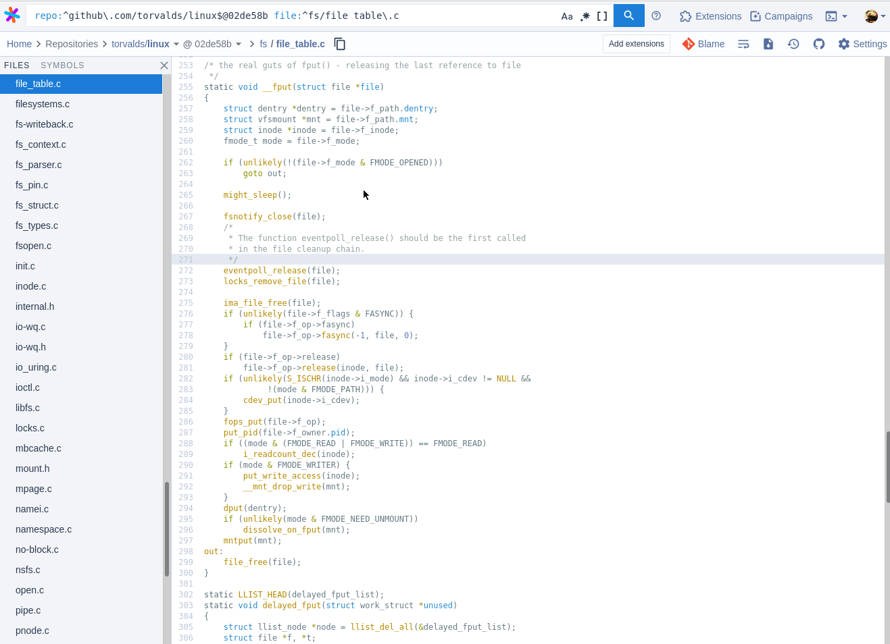

# lsif-clang examples

This page provides examples of generating compile_commands.json files for different buildsystems.

## [github.com/torvalds/linux](https://github.com/torvalds/linux)



Once you've installed the kernel dependencies (you can use the table in `Documentation/process/changes.rst`), run the following commands from the repository root:
```sh
make allyesconfig
make CC=clang-10 HOSTCC=clang-10 `# replace with your clang version`
scripts/gen_compile_commands.py
lsif-clang compile_commands.json
```

## [github.com/envoyproxy/envoy](https://github.com/envoyproxy/envoy)

Use the following steps:
```sh
./bazel/setup_clang.sh /usr/lib/llvm-10    `# or wherever your llvm installation lives`
echo 'build --config=clang' > user.bazelrc
TEST_TMPDIR=/tmp tools/gen_compilation_database.py --include_headers --run_bazel_build
lsif-clang compile_commands.json
```

## [github.com/grpc/grpc](https://github.com/grpc/grpc)
Install the [Ninja build tool](https://ninja-build.org/), and run the following commands from the repository root:
```sh
cmake -B build -DCMAKE_EXPORT_COMPILE_COMMANDS=ON -Dgrpc_BUILD_TESTS=ON -G Ninja
ninja -C build $(egrep -e '^build[^:]+.pb.(cc|h|c|cpp|inc|hpp)[: ]' build/build.ninja | awk '{print $2}')  `# generate pb`
lsif-clang build/compile_commands.json
```
